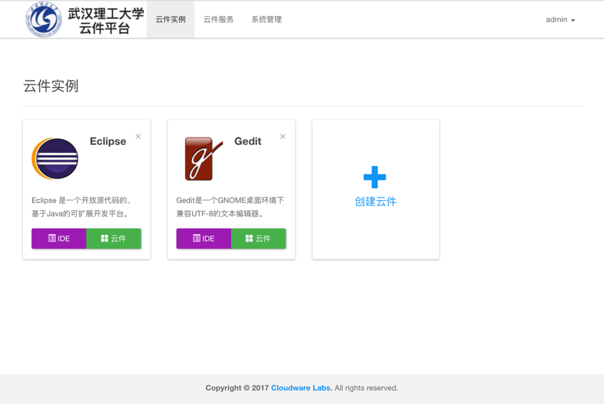
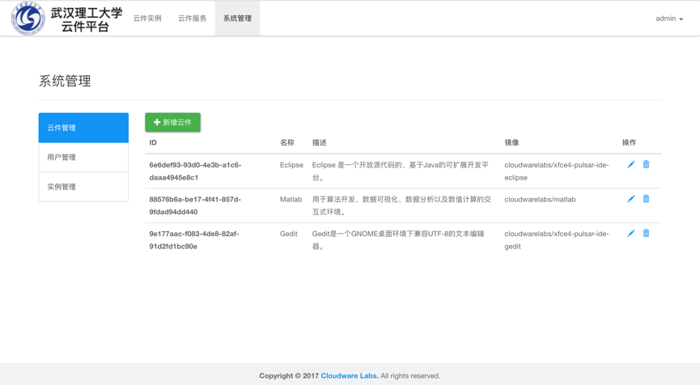
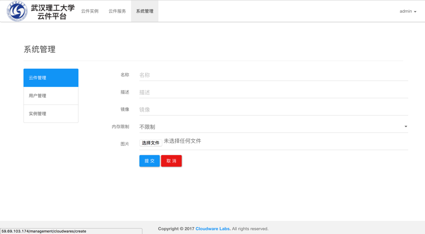
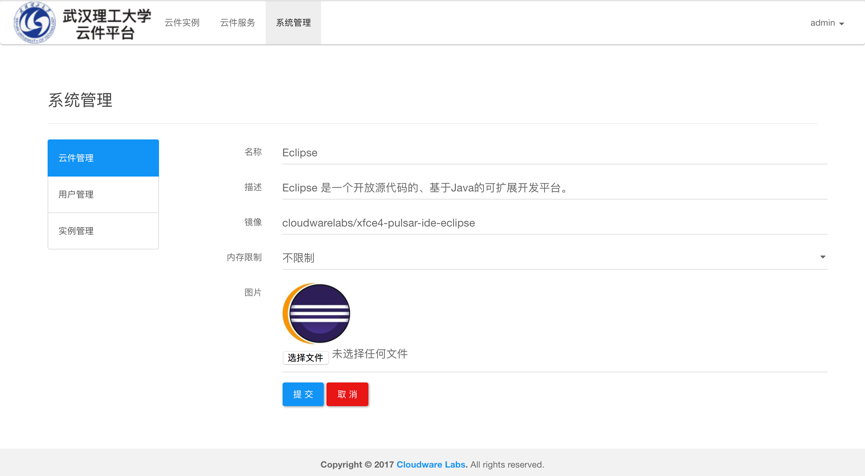
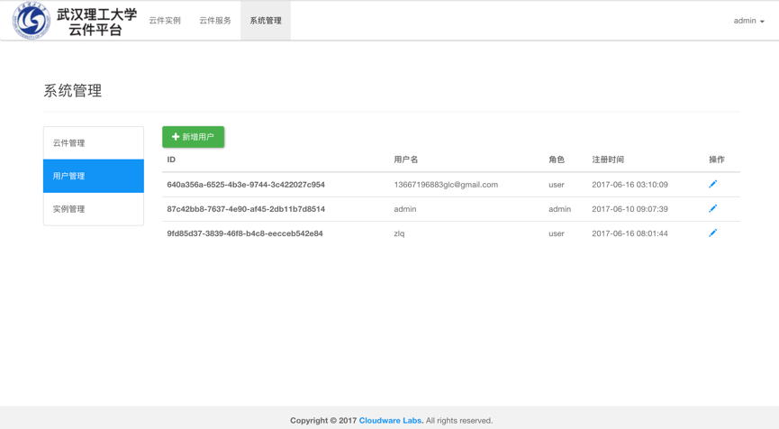
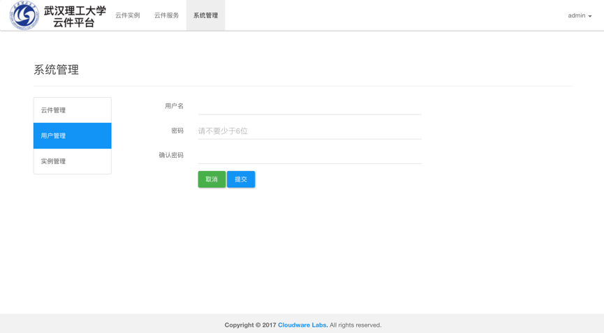
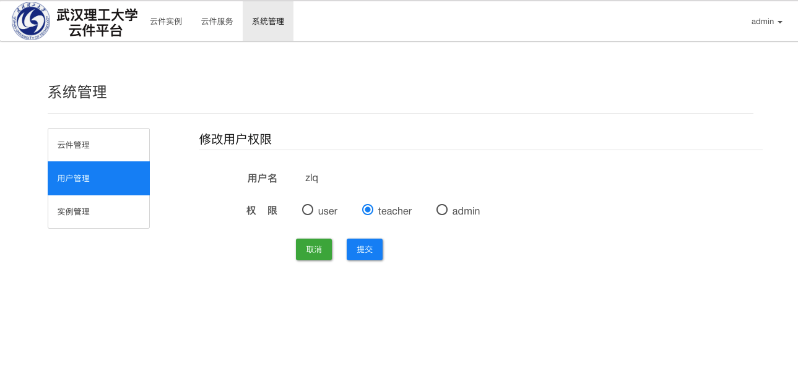
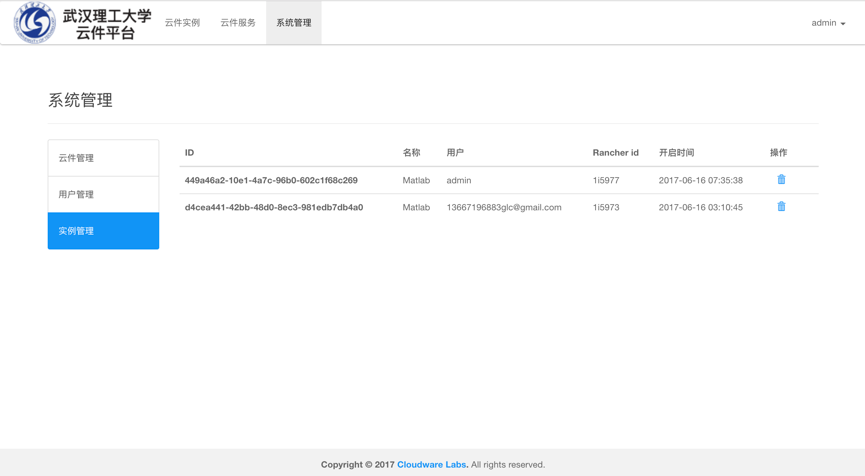

# 4 管理员操作

​	管理员拥有普通用户的所有权限，并且拥有用户管理、云件管理、实例管理权限。管理员与普通用户的登录入口相同，登录之后看到的首页如下。点击“系统管理”，可进入云件、用户、实例管理页面。

## 4.1 云件管理

​	云件管理板块提供了对系统中已有云件的增、删、改功能，操作截图如下：

​	点击主面板左上角“新增云件”，进入新增云件镜像页面：

​	点击单个云件右边的修改标示，进入修改已有云件镜像页面：

## 4.2 用户管理

​	点击用户管理，可看到当前注册用户的列表。用户管理板块提供了新增、删除、修改用户角色等功能，操作截图如下：

​	点击主面板左上角“新增用户按钮”，进入新增用户页面:

​	点击单个用户右边对应的修改标示，进入用户权限修改页面，该页面中可以选择将该用户的角色置为管理员：

## 4.3 实例管理

​	点击实例管理，可以查看到当前系统中已启动的所有实例信息。管理员可以根据需要将其删除。

