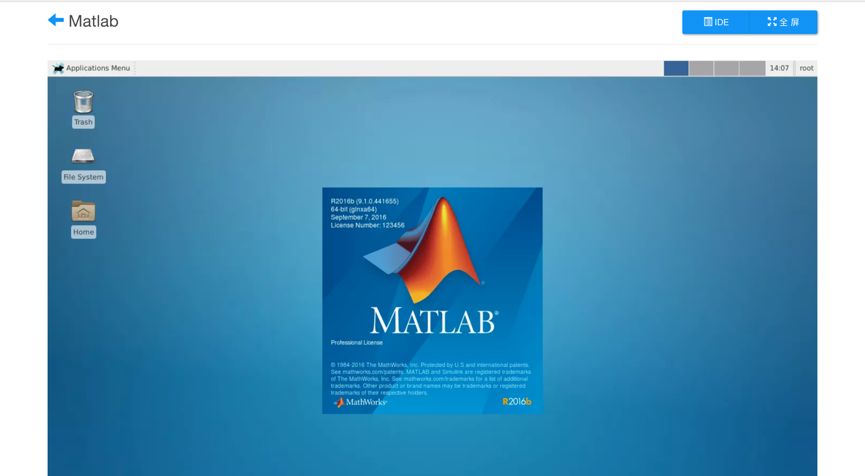
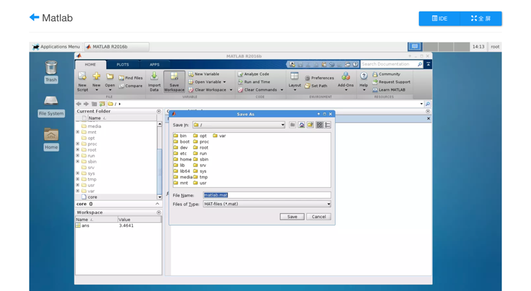

# 云件使用

1. 用户登录之后，点击‘云件服务’，可查看当前可用云件列表。

2. 选择要使用的云件（如Matlab），点击‘立即开启’，会进入云件启动状态：

	3.	云件会在10秒中之内启动成功并自动开启用户所选的Matlab程序，如下图所示。云件界面上部包含三个按钮，从左到右功能分别为：返回云件实例列表、进入该云件对应的文件系统、使云件画面全屏。

4. 用户可以像在本机一样使用Matlab。下图显示了在云件Matlab中进行数学基本运算等操作。

   

   ​

5. 可以将工作空间保存在该云件对应的文件系统，如图，我们将上述工作空间命名为matlab.mat并保存在根目录下。

   

注：若此时用户点击左上角的后退按钮退出云件，系统并不会立即销毁该云件镜像，用户下次点击进来会看到与其退出时相同的工作界面。