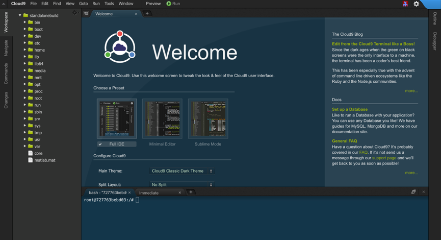
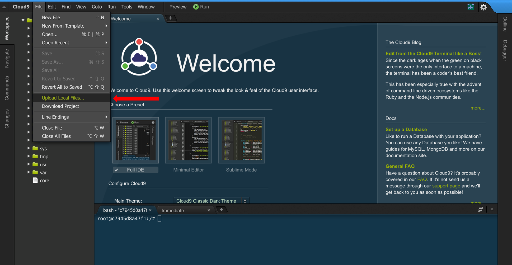
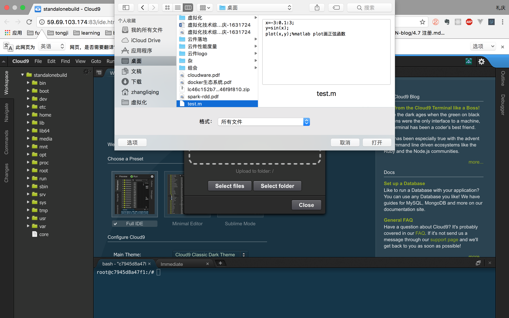
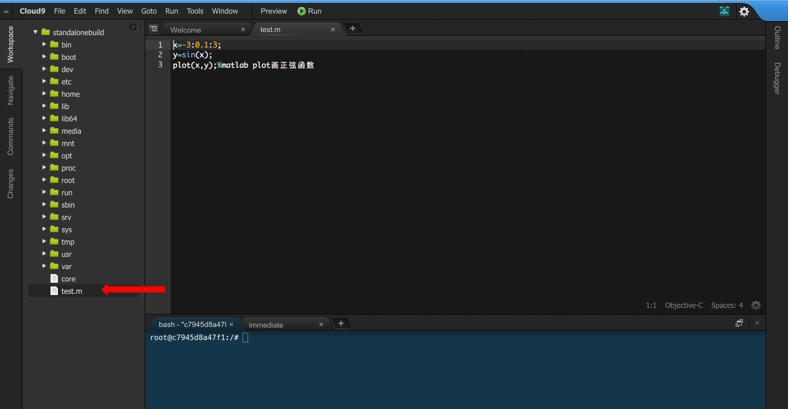
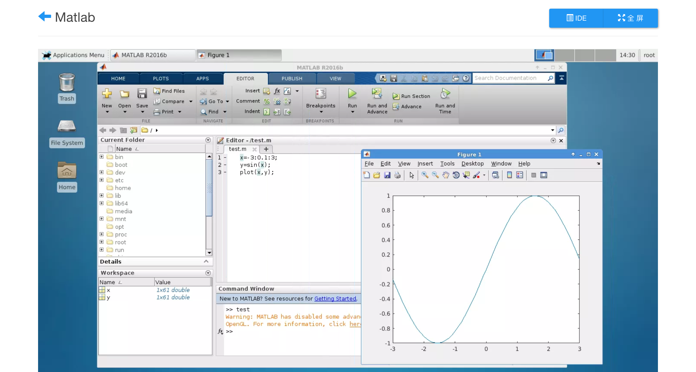
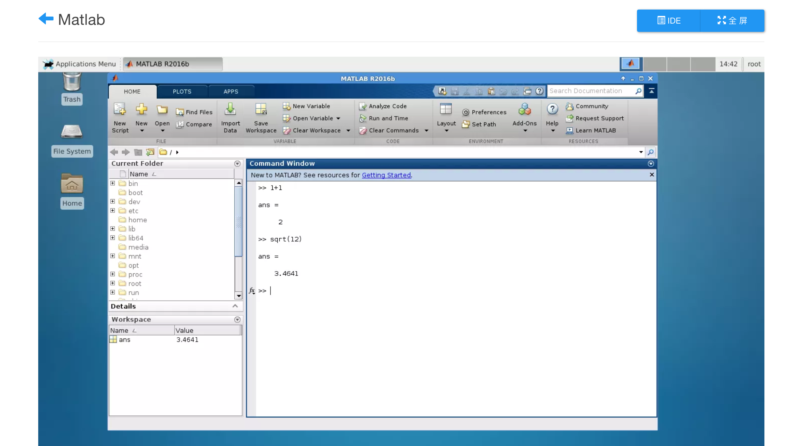
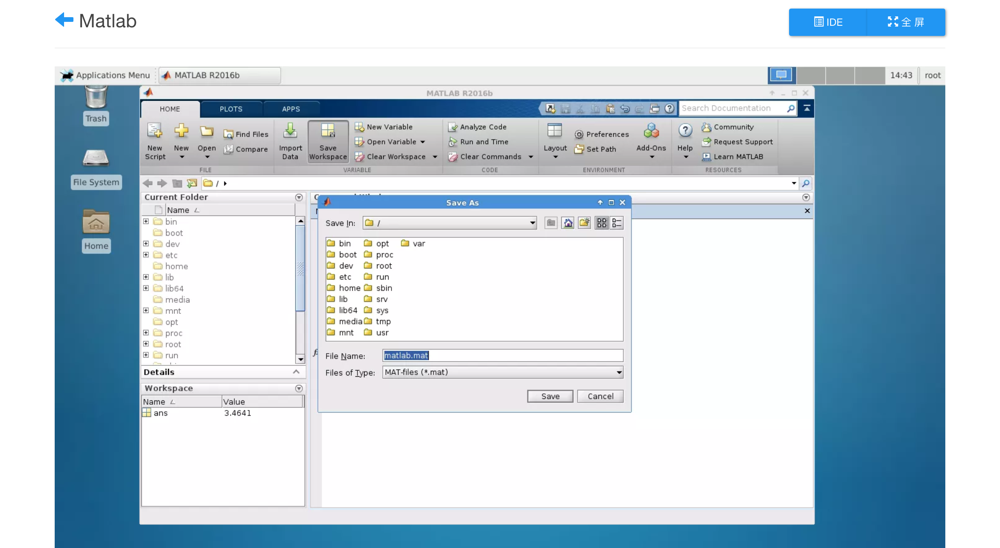
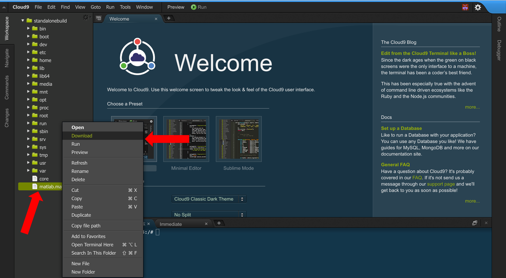
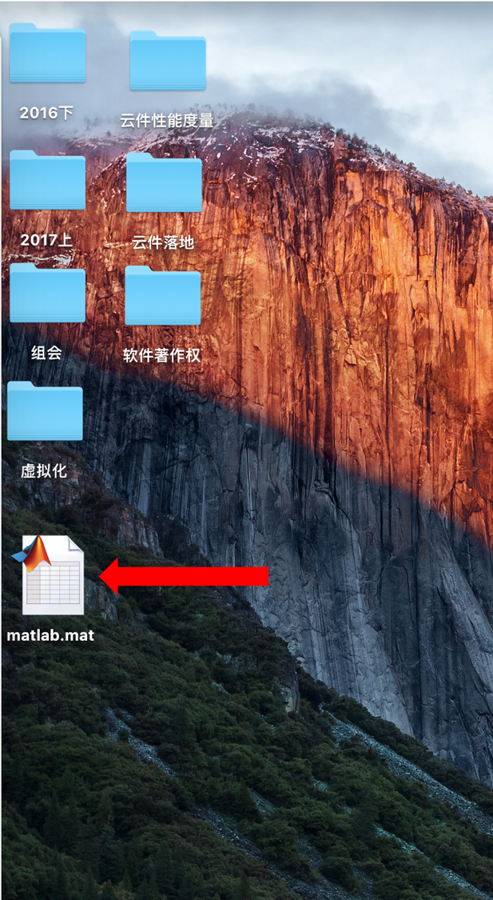

# 4. 文件上传与下载

## 4.1 文件上传

##### 用户可以将本地编辑好的作业文件上传至云件中执行。以下过程简述了此功能的操作流程。

1. 点击云件对应的IDE按钮，进入云件平台的文件管理页面。

   

   ​

   

   ​

2. 点击菜单栏 ‘file’ -> 'Upload Local Files'上传本地文件。

   

   ​

   

   ​

3. 上传成功后可以在上传路径下看到该文件：

   

   ​

4. 打开MATLAB云件，执行刚刚上传的test.m文件。

   

   ​

5. 点击matlab执行按钮，可以看到成功执行了用户上传的作业。

   

   ​

   ​

   # 4.2 文件下载

   ##### 用户在云件中编辑了作业之后，可以将其下载至本地，以下操作简述了这一过程。

   1. 假设在matlab云件中编辑所需了的内容并将工作空间保存在了对应文件系统的根目录下：

      

      ​

      

      ​

   2. 点击云件右上角的"IDE"按钮，转至云件文件系统界面，可以看到用户所保存的matlab.mat文件已经在根目录下了，在matlab.mat上右击，选择右键菜单栏中的"Download"选项，可将文件下载至本地。

      

      ​

   3. 查看本地桌面，可以看到下载的matlab.mat文件。

      

      ​

   ​

