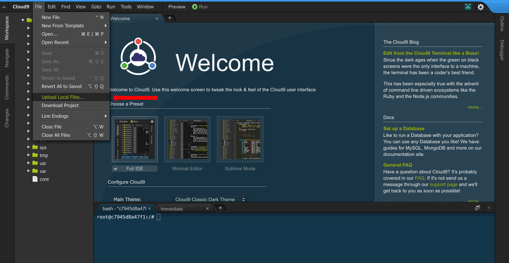
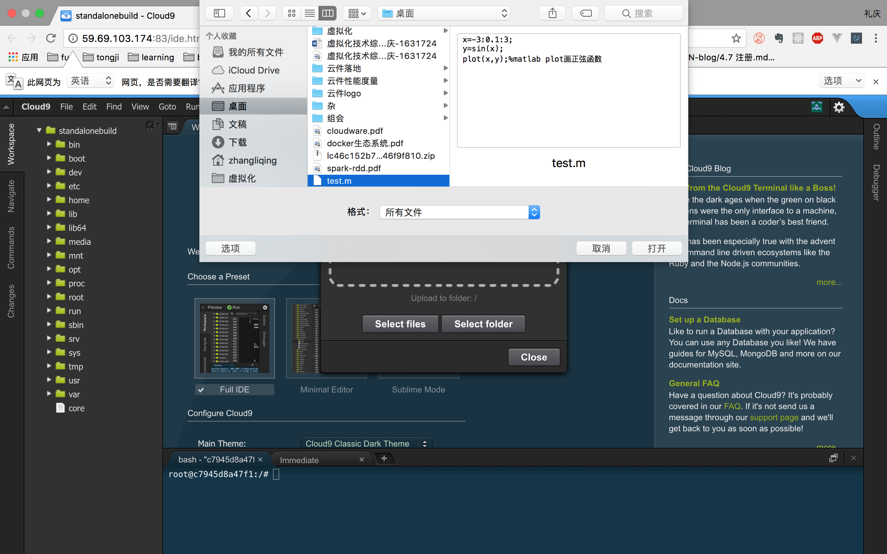
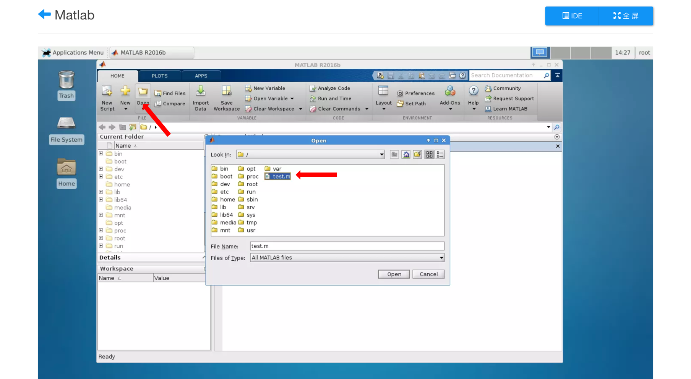
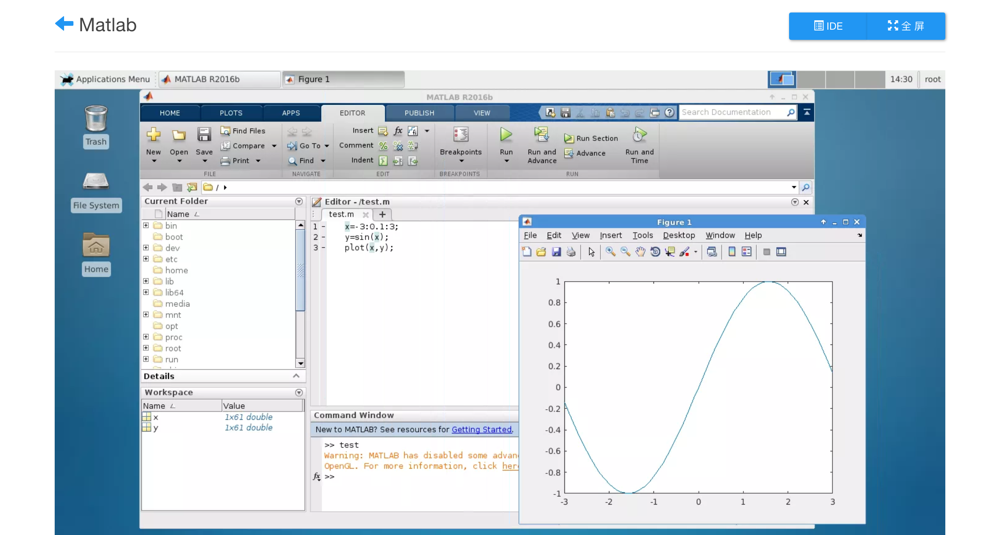

## 作业上传

用户可以将本地编辑好的作业文件上传至云件中执行。以下过程简述了此功能的操作流程。

1. 点击云件对应的IDE按钮，进入云件平台的文件管理页面。

   

   

   ​

2. 点击菜单栏 ‘file’ -> 'Upload Local Files'上传本地文件。

   

   ​

   

   ​

3. 上传成功后可以在上传路径下看到该文件：

   

   ​

4. 打开MATLAB云件，执行刚刚上传的test.m文件。

   

   ​

5. 点击matlab执行按钮，可以看到成功执行了用户上传的作业。

   

   ​

   ​

   ​

