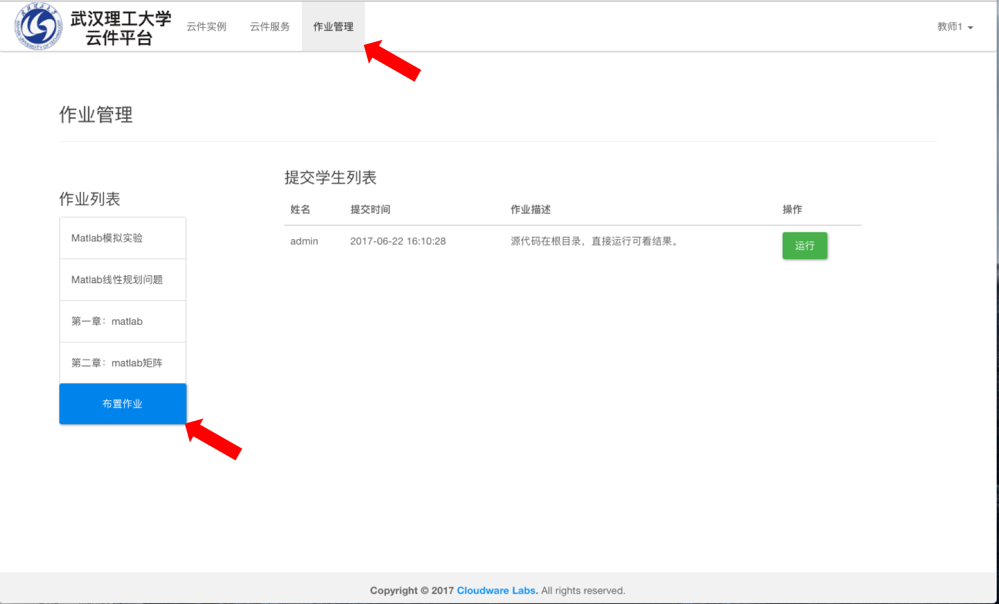
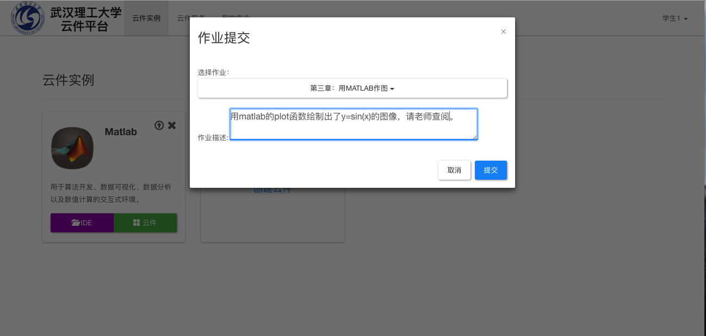

# 5. 作业周期管理

### 	在常规的教学流程中，作业的周期可划分为：

### 		（1）教师布置作业

### 		（2）学生书写并提交作业

### 		（3）教师检查作业

### 	云件平台以一种异常便捷的方式实现了这一过程。

### 5.1 教师布置作业

​	以教师身份登录后，点击菜单栏的“作业管理”,可到作业管理板块。如下图所示，该板块显示了当前布置的作业的作业列表，以及每项作业对应的学生提交情况。我们点击“布置作业”按钮来新建一项作业：

​	在弹出的对话框中，填入作业的名称及相应的描述：

​	点击提交，可以看到作业已新建成功：

### 5.2 学生书写并提交作业

​	学生账号登录后，点击菜单栏中“我的作业”按钮，可查看当前要完成的作业列表，及自己的提交记录。如下图所示，我们假设该生想要完成“第三章：用matlab作图”这项作业，因该生没有过提交记录，所以“已提交作业”列表为空。

​	

​	因“第三章：用matlab作图”这项作业要用到matlab软件来完成，我们点击菜单栏中“云件服务”按钮，找到matlab云件，点击“立即开启”：

​	在打开的matlab云件里完成作业，即用plot函数绘图，假设该生的作业完成效果如下所示：

​	点击左上角的返回按钮，回到云件实例板块，可以看到列表中存在了一个matlab实例，该实例就对应刚刚该生完成作业的那个云件。点击该实例右上角的提交按钮：

​	在弹出的对话框中选择对应的作业题目，输入想写给老师的作业描述，点击提交:

​	如下图所示，提交完成后，我们可以看到云件实例中的matlab实例被移除了，因为作业提交之后该学生不再拥有对该实例进行操作的权利，该实例的操作权被移交给了相应的教师。

​	此时点击“我的作业”选项，可以看到刚才的提交记录。若该学生想对作业进行修改，可点击作业右边的撤销按钮，撤销之后云件实例的操作权会重新交给学生：

### 5.3 教师检查学生提交的作业

​	有学生提交过作业之后，教师便可在作业管理面板中看到相应的提交列表，下图显示了刚刚那位学生提交的作业：

​	使用云件的一大好处就是学生端和教师端的运行环境完全相同，教师只需点击作业右边对应的“运行”按钮，便可立即查看学生作业的运行情况，效果如下图所示：

##### 教师可根据作业的运行情况给学生打相应的分值。至此教学中整个的作业周期都已在云件中完成。

