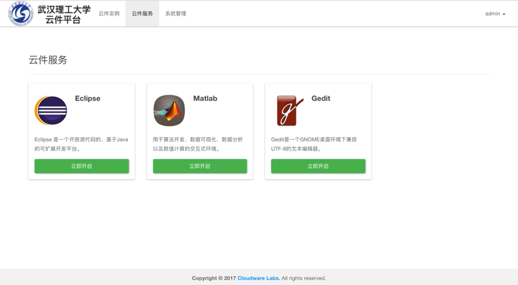
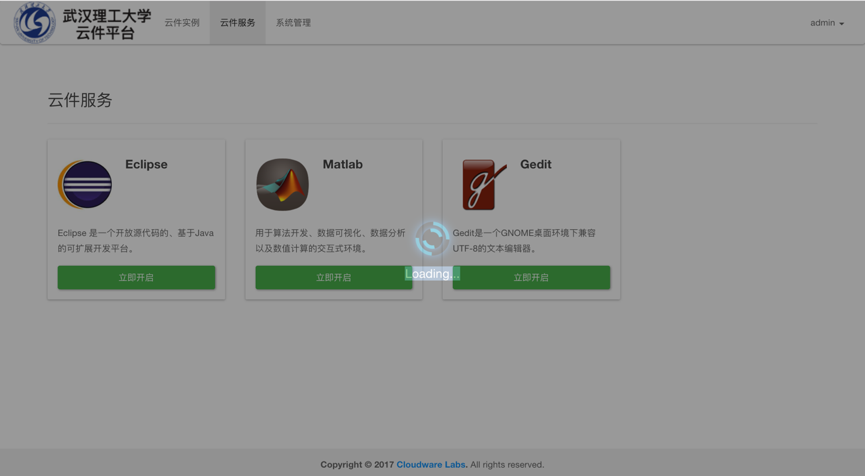
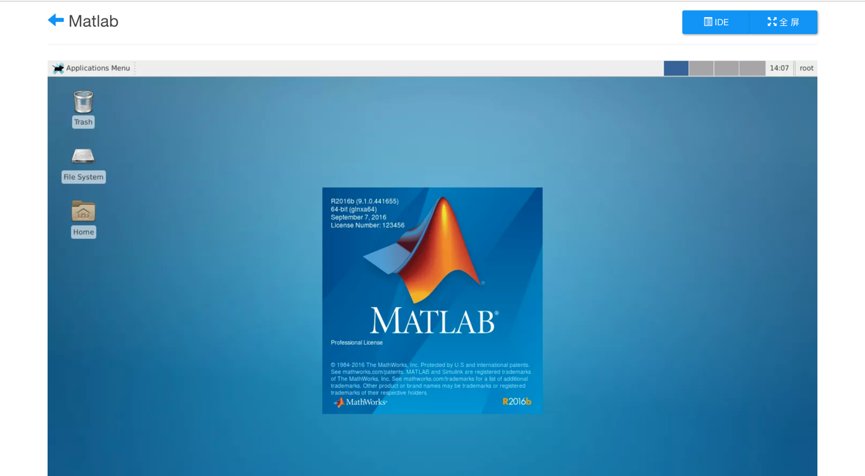
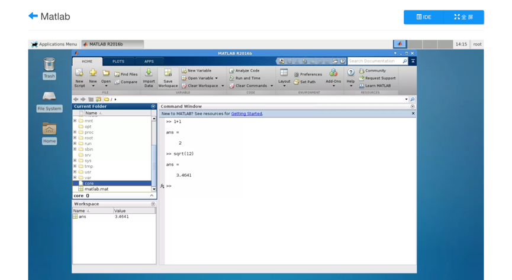
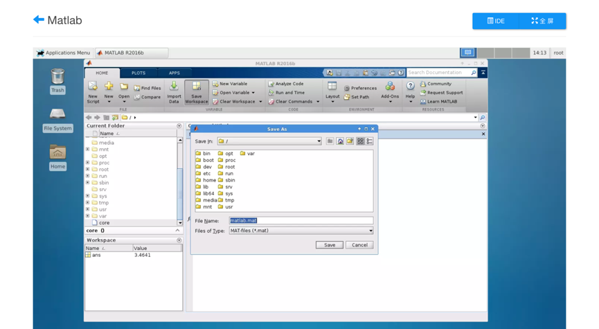

# 3. 运行云件

1. 点击云件服务，可查看当前可用的云件列表。

   

   ​

2. 选取要使用的云件（如Matlab），点击‘立即开启’，会进入云件启动状态：

   

   ​

3. 云件会在10秒中之内启动成功并自动开启用户所选的Matlab程序，如下图所示。

   

   ​

4. 用户可以像在本机一样使用Matlab，点击全屏可使云件布满整个显示器屏幕，进一步提高使用体验。下图在云件Matlab中进行了基本运算并将工作空间保存在根目录下的matlab.mat文件中。

   

   

### 注：

​	若此时用户点击左上角的后退按钮退出云件，系统并不会立即销毁该云件镜像，用户下次点击进来时会看到与其退出该云件时相同的界面。