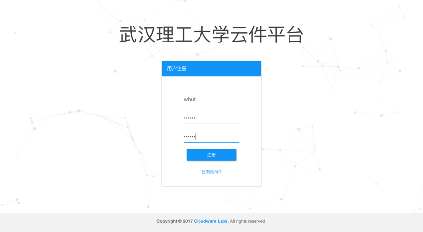
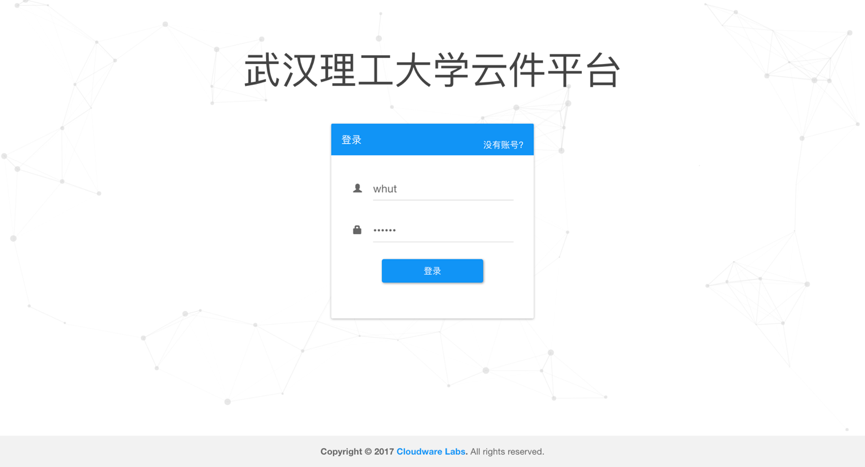
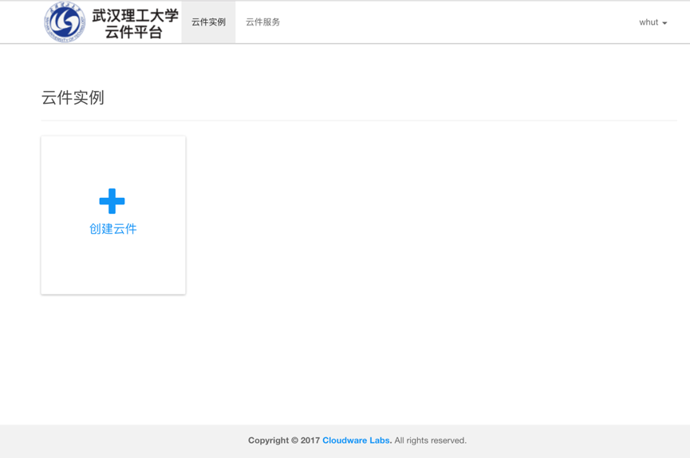

# 2. 注册与登录

### 云件平台共分为三种角色：管理员、教师、学生

### 用户注册默认角色为学生，管理员可以在用户管理页面中更改用户的角色。

以下简述了该平台的注册和登录流程：

​	在浏览器中输入网址http://59.69.103.174/，即可进入系统欢迎界面，如下图所示。点击注册，进入账户注册页面，输入用户名及六位以上密码。注册成功后将自动重定向至系统登录页面，输入用户名及密码即可登录成功。

​	

### 2.1系统注册页面：

​	

### 2.2 系统登录页面：

​	

### 2.3 成功登录后的系统主页：

