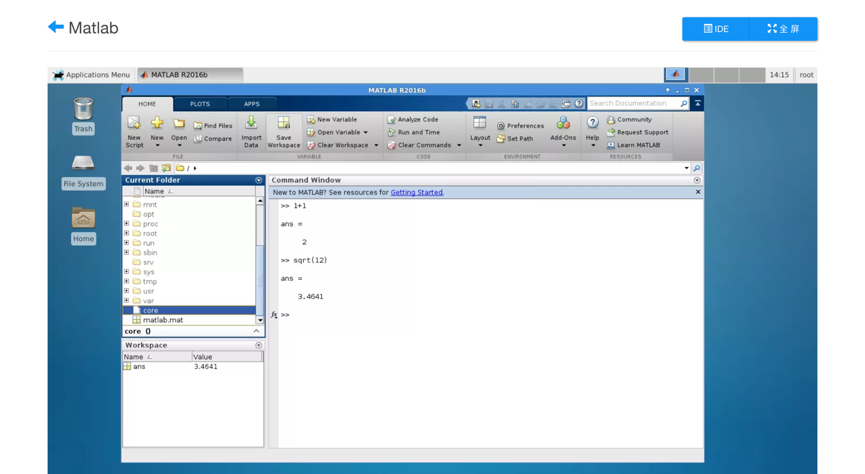
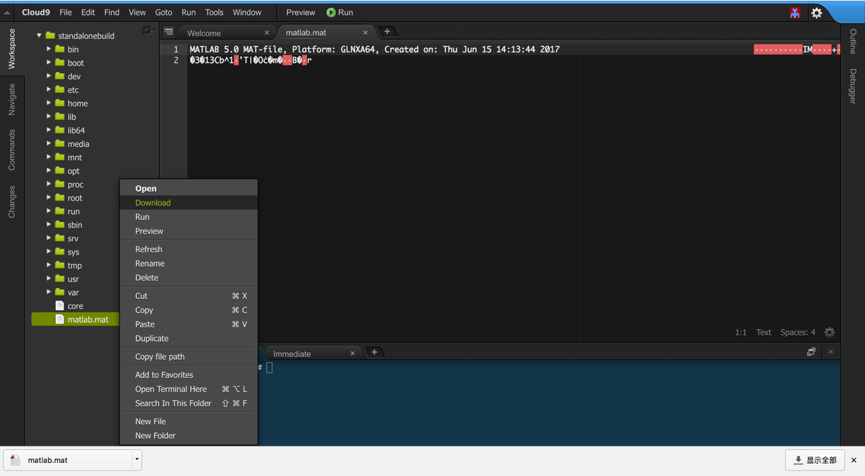
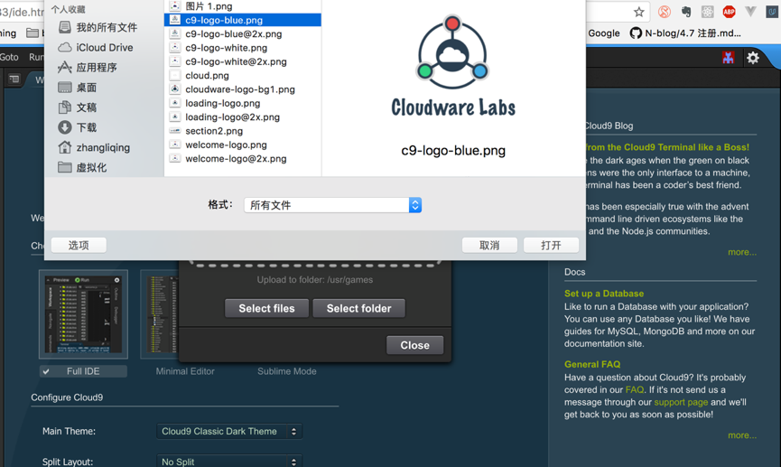
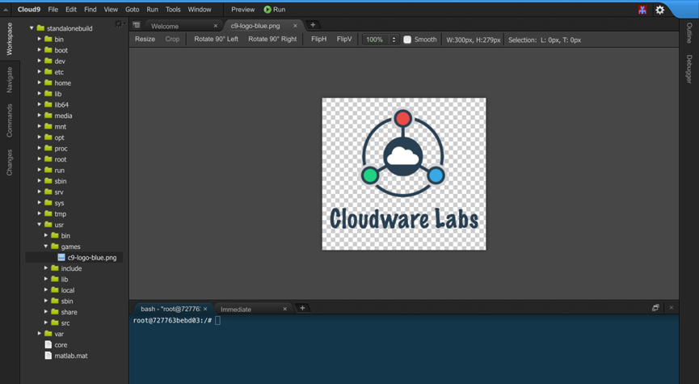
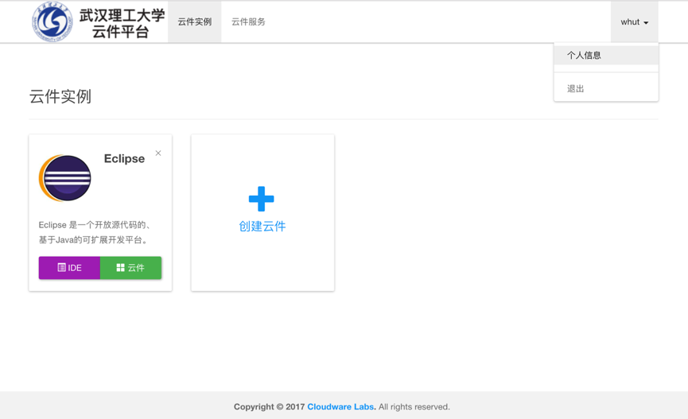
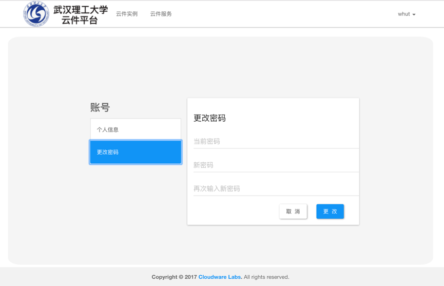

# 3 普通用户操作

## 3.1 云件操作

​	

点击云件服务，可查看当前可用的云件列表。

​	

​	选取要使用的云件（如Matlab），点击‘立即开启’，会进入云件启动状态：

​	云件会在10秒中之内启动成功并自动开启用户所选的Matlab程序，如下图所示。

​	用户可以像在本机一样使用Matlab，点击全屏可使云件布满整个显示器屏幕，进一步提高使用体验。下图在云件Matlab中进行了基本运算并将工作空间保存在根目录下的matlab.mat文件中。

​	

​	若此时用户点击左上角的后退按钮退出云件，系统并不会立即销毁该云件镜像，用户下次点击进来时会看到与其退出该云件时相同的界面。

​	云件右上角的IDE按钮是该用户在云端文件系统的入口，存储了该用户的所有文件，并提供了文件上传、下载、编辑等功能。点击IDE按钮在开启文件系统界面，如下图所示。

​	可以在刚刚指定的文件路径下找到创建的matlab.mat文件，并可以对其文件进行常规操作，下图所示是将matlab.mat文件下载到本地。

​	同时还支持将用户本地文件上传至云件文件系统中，点击‘File’-‘Upload Local Files’可打开文件上传面板，操作流程如下图所示。

​	首先点击“Selecte files”按钮，打开本地文件系统，选中要上传的文件（如c9-logo-blue.png）,点击“打开。”

​	可以看到c9-logo-blue.png已经被成功上传到云件文件系统中:

## 3.2 个人信息管理

​	用户点击首页右上角课进入个人信息管理页面，该页面提供了对用户名和对应密码的修改操作。

​	修改密码页面：

